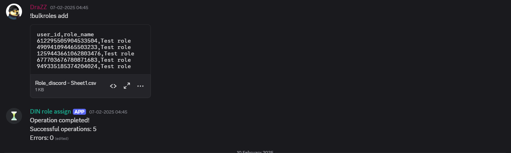
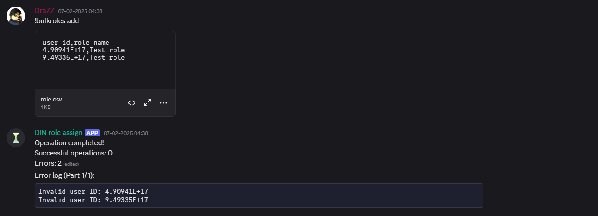
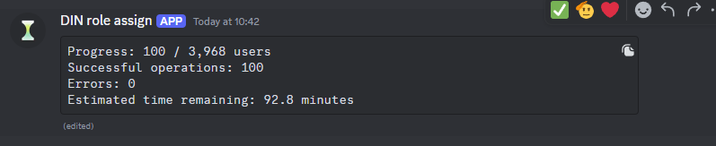
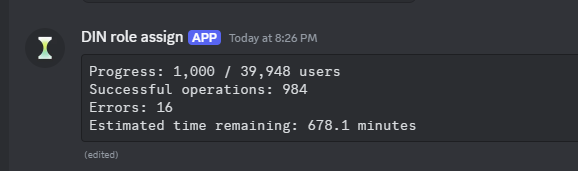
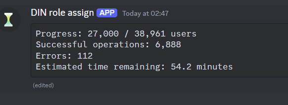

# discord-mass-role-bot

## The situation

In February 2025, a marketing campaign my team ran went wrong in a way that left tens of thousands of Discord accounts needing a role applied (or removed) manually — something Discord's own UI has no bulk tool for, and the audit trail existed only as a spreadsheet of user IDs. With the clock running, I built a bot to do it: read a CSV, resolve each user, apply the role, and not fall over if it got interrupted partway through 60-70k accounts.

It ran in production against real runs of ~40,000 users at a time, checkpointing its progress so a restart wouldn't mean starting over. It did the job. This repo is that bot, as it shipped — written for correctness and resumability under time pressure, not for elegance.





Early tests on 2025-02-07, working out CSV formatting issues (Excel's auto-conversion of long IDs to scientific notation) before the real run.

## What it does

A single Discord bot command, `!massroles`, takes a CSV of user IDs and a role name, then adds or removes that role for every user in the file — in chunks, with progress reporting, and with enough state on disk to resume if it's interrupted.

```
!massroles <add|remove> <role_name> [start_index]
```

- Attach a CSV (`user_id` in the first column) to the command message.
- Users are processed in chunks of 10,000, each chunk split into batches of 1,000.
- Progress, success/error counts, and an ETA are posted back to the channel and updated live.
- Every completed chunk is checkpointed to `checkpoint_<guild_id>.json`. If the bot restarts mid-run, the next `!massroles` call automatically skips everyone already processed.
- `!shutdown` cleanly closes the bot (admin-only).

## Flow

```
Discord message → !massroles action role [start_index]
  → permission check (Manage Roles) → reply & stop if missing
  → validate: CSV attached, role exists, role below bot's own top role → reply & stop if not
  → parse CSV, load checkpoint, drop already-processed IDs
  → loop: next chunk (10k) → next batch (1k) → resolve members → apply role → update status
      (checkpoint saved after each chunk)
  → final summary posted
```

`!shutdown` is a separate, short path: admin check → farewell message → `bot.close()`.

A Flask thread (`keep_alive()`) runs the whole time independently of either command, for hosts that expect an HTTP port to stay open.

## Real-world numbers

From actual production runs (Feb 2025):

- Processed batches of **~39,948** and **~38,961** users in single runs
- Progress and ETA were tracked live per batch







## Setup

```
pip install -r requirements.txt
cp .env.example .env   # fill in DISCORD_TOKEN
python complete-discord-bot.py
```

Requires the **Server Members** and **Message Content** privileged intents enabled in the Discord Developer Portal, and the bot's own role positioned above any role it needs to manage.

## Known limitations

This was written to solve an active incident, not to be a polished tool. If I were building it again:

- **No self-imposed rate limit.** Each batch fires up to 1,000 role-update requests concurrently via `asyncio.gather`; pacing is left entirely to discord.py's reactive rate-limit handling rather than a controlled cap (e.g. a `Semaphore`).
- **Checkpoints only every 10,000 users**, not every batch — an interruption mid-chunk can cost up to 1,000 users of re-work.
- **No dry-run / preview mode** — the first CSV you attach is the one that runs.

## Stack

Python · discord.py · Flask (keep-alive)
